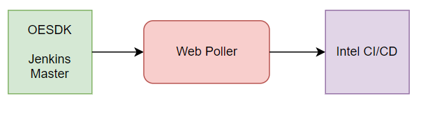

## Intel CI Integration

Intel integrates their on premises ci/cd with the Open Enclave SDK through the use of a web poller system. In short, their infrastructure is triggered by the upstream Jenkins masters which connects to the web poller and this in turn triggers their CI/CD.

## How does the master call the poller?

The upstream jenkins masters calls the web poller through the use of a simple script running in a container. The script does not add additional testing logic to these test's just triggers them and returns the logs.

Container location: [dockerhub](https://hub.docker.com/layers/openenclave/jenkinsoperator/latest/images/sha256-5ede2c32cd8d19111b7e6d9315549584240487845b32bd36ede2cf7339fbdb1b?context=explore)

Script location: [jenkins_trigger](https://github.com/openenclave/test-infra/blob/master/scripts/intel/jenkins_trigger.py)

## I need to update the script, what do I do?

If you find yourself needing to update the script. Do the following.

1. Clone [test-infra](https://github.com/openenclave/test-infra)
2. Do your modifications/testing etc.
3. Build [jenkins operator](https://github.com/openenclave/test-infra/tree/master/images/jenkinsoperator)
4. Verify the script works by changing out the image [used](https://github.com/openenclave/openenclave/pull/3952/files#diff-7bc727e7422ac55516c0139bbbad1df8addbf389a638c0be5b4f8f55d02dd92aR23) in CI/CD and open a pull request to Open Enclave.
5. Open a pull request to test-infra.
6. Create an issue in test-infra, and the oeciteam will merge the pull request and create and push the new image.

