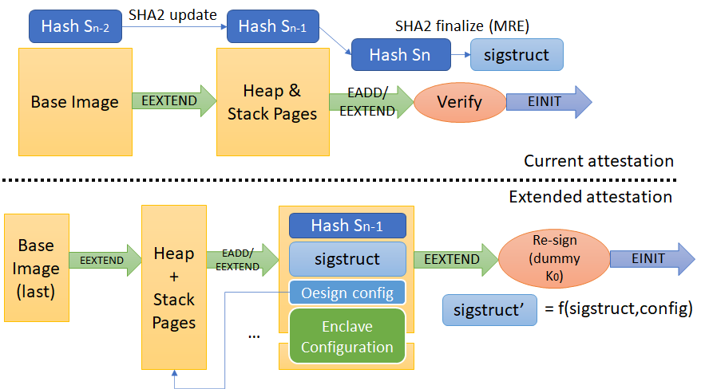

Extended Enclave Initialization Data
====================================

We present an experimental extension to attestation in OpenEnclave that enables the attestation of enclave initialization parameters.
Our extension uses TEE evidence (e.g. MRENCLAVE in SGX) as a platform configuration register to measure additional data besides the signed enclave image, such as instance-specific enclave configuration and the settings in the current enclave signing configuration.

We introduce a new OE evidence type that holds extended enclave initialization data (EEID).
Recipients of such evidence must be able to recover and verify the original enclave identity information (including the original evidence, like MRENCLAVE and MRSIGNER in the case of SGX), based on the knowledge of the EEID, which is transmitted alongside the evidence as a new type of endorsement.

Motivations
-----------

In today's OE evidence, applications can attest their configuration as part of the `report_data` argument of `oe_get_report`.
This mechanism works robustly when the application code is entirely and statically known to the verifier of the evidence.

Things get more complicated if an enclave executes user code that is not part of the signed enclave image. For instance, consider an enclave containing a JavaScript interpreter that executes user scripts that originate from the untrusted host in shared enclave memory, and which has access to the `oe_get_report` API. It is impossible to know which script has been executed by such an enclave based on traditional evidence, even if the hash of the script is included in the `report_data`, because a malicious script can obtain valid evidence via `oe_get_report`, while still being an approved and attested script. If both, the interpreter and the script, operate in the same, shared address space, then they can interfere with each other and alter each others' attestation-relevant information. Similarly, if an enclave loads and executes arbitrary assembly code from the host, this assembly code can use an in-enclave CPU instruction, for instance the `EREPORT` instruction on SGX, to create valid evidence - hence, it is impossible to use traditional attestation to determine which assembly code was executed by the enclave. Layered attestation provides a way for one of the components to attest the other one, but if they execute within the same address space, the problem remains. The EEID proposed here provides a means to solve this problem, by requiring an attestable commitment to all relevant enclave initialization data upfront, eliminating the possibility of interference later on.

One way to solve this issue is to re-compile and re-sign a new enclave image for every container we launch (with the container data being measured together with the LKL base image). However, this approach is cumbersome as we would like to be able to launch arbitrary containers on demand without having to build and sign a new enclave image every time.

Another class of problems we address is dynamic attestation of the memory and threading configuration. In current OE attestation, these settings (`NumStackPage`, `NumHeapPages`, `NumTCS`) are fixed at enclave signing time. This means that it is not possible to deploy the same enclave image with different memory and threading configurations.

User Experience
---------------

The new API is experimental and details are subject to change, but the examples given here give an idea of the added functionality.

We recommend that all parameters specified at enclave signing time should be set to a value that would prevent the enclave from loading, typically 0. This guarantees that enclave images meant to be used with EEID cannot be accidentally initialized with traditional attestation. In the case of SGX that means `NumStackPages=0`, `NumHeapPages=0`, and `NumTCS=1`. `NumTCS=0` would be a more obvious choice than `NumTCS=1`, and simplify the EEID report verification implementation, but based on the specific existing implementation of TCS page initialization in OE SDK, `NumTCS=1` is chosen for a security consideration. The rational is discussed in later section about EEID reports verification.

To launch an EEID enclave, the user uses a new type of `oe_enclave_setting_t` called to be passed to `oe_create_enclave` API:

```C
typedef enum _oe_enclave_setting_type
{
    ...
#ifdef EXPERIMENTAL_EEID
    OE_ENCLAVE_SETTING_EEID = 0x...,
#endif
} oe_enclave_setting_type_t;

typedef struct _oe_enclave_setting
{
    oe_enclave_setting_type_t setting_type;
    ...
    union {
        const oe_enclave_setting_context_switchless_t*
            context_switchless_setting;
#ifdef EXPERIMENTAL_EEID
        const oe_eeid_t* eeid;
#endif
    } u;
} oe_enclave_setting_t;
```

The additional union member is of type `oe_eeid_t`, which contains the following information:

```C
#ifdef EXPERIMENTAL_EEID
typedef struct oe_eeid_t_
{
    uint32_t version;        /* version number of the structure */
    uint32_t hash_state[10]; /* internal state of the hash computation at the end of the enclave base image */
    uint64_t signature_size; /* size of signature */
    oe_enclave_size_settings_t size_settings; /* heap, stack and thread configuration for this instance */
    uint64_t vaddr;          /* location of the added data pages in enclave memory; EEID follows immediately thereafter */
    uint64_t entry_point;    /* entry point of the image, for SGX, matches TCS.OENTRY */
    uint64_t data_size;      /* size of application EEID */
    uint8_t data[];          /* Buffer holding EEID data followed by the signature */
} oe_eeid_t;
#endif
```

Once an enclave has been started with EEID, it can use `oe_get_evidence` as usual to obtain evidence, except that this evidence will not be verifiable by verifiers built without EEID support, e.g. based on the Intel SGX SDK.
However, enclaves built with OE can appraise this evidence, using `oe_verify_evidence` as usual, regardless of whether they themselves use EEID, as long as their version of OE supports EEID.

Specification
-------------



The changes introduced by EEID are mostly internal to the enclave initialization function (`oe_create_enclave`) and the attestation functions (`oe_get_evidence`/`oe_verify_evidence`).

First, before an enclave image with EEID is loaded, we patch the size settings from the signed image with instance-specific settings, for instance as in the following SGX-based example (the symbols for other TEEs may have different structure):

```C
    if (eeid)
    {
        // Check that size settings are zero as an indication that the
        // image was intended to be used with EEID.
        if (props.header.size_settings.num_heap_pages != 0 ||
            props.header.size_settings.num_stack_pages != 0 ||
            props.header.size_settings.num_tcs != 1)
            OE_RAISE(OE_INVALID_PARAMETER);

        props.header.size_settings.num_heap_pages =
            eeid->size_settings.num_heap_pages;
        props.header.size_settings.num_stack_pages =
            eeid->size_settings.num_stack_pages;
        props.header.size_settings.num_tcs = eeid->size_settings.num_tcs;

        // Patch ELF symbols
        elf64_sym_t sym_props = {0};
        const elf64_t* eimg = &oeimage.u.elf.elf;
        if (elf64_find_symbol_by_name(
                eimg, "oe_enclave_properties_sgx", &sym_props) == 0)
        {
            uint64_t* sym_props_addr = NULL;
            sym_props_addr =
                (uint64_t*)(oeimage.image_base + sym_props.st_value);
            oe_sgx_enclave_properties_t* p =
                (oe_sgx_enclave_properties_t*)sym_props_addr;
            p->header.size_settings = props.header.size_settings;
        }
    }
```

This alters the computation of the enclave hash (e.g. `MRENCLAVE` on SGX) as the sequence of protected memory pages (e.g. via `EADD/EEXTEND`) is modified with EEID after signing. Thus, we save the state of the hash computation before adding these pages, as it will be needed to verify EEID evidence. This also requires minor additions to `oesign`, such that the extended metadata (base image `hash_state`, `vaddr`, and `signature`) can be dumped from signed enclave images, to enable the prediction of hashes before an enclave is started.

For SGX enclaves, the enclave linear address space size in `SECS` is measured at the beginning of the hashing process, impacting the enclave measurement value. Adjusting the enclave linear address space size based on instance-specific settings would alter the base image measurement. Therefore, the enclave linear address space size of the base image is set to a large fixed value, for example 64GB. If the instance-specific heap/stack/tcs setting does not fill the enclave linear address space, the enclave pages at the end of the enclave are not committed. If enclave code attempts to access those pages, page fault will be triggered, same as when enclave code attempts to access "guard" pages.

Then, after the enclave image is loaded but before it is initialized, we add the additional memory pages containing the contents of the `oe_eeid_t` struct (for instance with an SGX `sigstruct` signature):

```C
        oe_sha256_context_t* hctx = &context->hash_context;
        sgx_sigstruct_t* sigstruct = (sgx_sigstruct_t*)properties->sigstruct;
        memcpy(eeid->signature, (uint8_t*)sigstruct, sizeof(sgx_sigstruct_t));
        eeid->vaddr = *vaddr;
        eeid->entry_point = oeimage.entry_rva;

        uint64_t ee_sz = sizeof(oe_eeid_t) + eeid->data_size;
        uint64_t epg_sz = eeid_pages_size_in_bytes(eeid);
        uint64_t num_pages = epg_sz / OE_PAGE_SIZE;
        assert(*vaddr == enclave_end - epg_sz);

        oe_page_t* pages = (oe_page_t*)eeid;
        if (ee_sz < epg_sz)
        {
            oe_page_t* tmp = (oe_page_t*)calloc(1, epg_sz);
            memcpy(tmp, eeid, ee_sz);
            pages = tmp;
        }

        OE_CHECK(_add_extra_data_pages(
            context, enclave->addr, pages, num_pages, vaddr));

        if (ee_sz < epg_sz)
            free(pages);

        OE_SHA256 ext_mrenclave;
        oe_sha256_final(hctx, &ext_mrenclave);
```

Finally, since our changes invalidate the signature of the base image, we need to dynamically re-sign the image as in the example (where the `signature` is a `sigstruct` in the case of SGX). For this, we use the `OE_DEBUG_SIGN_KEY`, which is well-known by all OE users and thus does not require additional public-key infrastructure support. Note that applications should never rely on the apparent signing entity (e.g. `MRSIGNER`) of EEID-enabled evidence. Instead, what we provide to the application when we appraise EEID evidence, is the evidence of the base image.

```C
        OE_CHECK(oe_sgx_sign_enclave(
            &ext_mrenclave,
            properties->config.attributes,
            properties->config.product_id,
            properties->config.security_version,
            OE_DEBUG_SIGN_KEY,
            OE_DEBUG_SIGN_KEY_SIZE,
            signature));
```

We also add a serialization function `oe_serialize_eeid` for the `oe_eeid_t`, so that EEID can be sent to verifiers as an endorsement for verification of the base image evidence together with the EEID configuration of the instance.

Verification of EEID reports
----------------------------

Verification of reports with EEID requires a fully populated `oe_eeid_t` and it performs the following steps (not necessarily in this order):

- Create a SHA256 context and restore the internal state to `hash_state`,
- re-measure the addition of heap and thread sections with stacks using the updated `size_settings`. Note that the number of TCS pages determines the number of thread sections. The measurement starts at address `vaddr` and includes `entry_point` in the TCS control pages,
- measure the additional page containing the `oe_eeid_t` (filled with the entire `oe_eeid_t`, including `data`),
- check that the final hash matches the hash reported in the extended report (e.g. MRENCLAVE),
- check the identity of the signer of the extended image (e.g. public key corresponding to `OE_DEBUG_SIGN_KEY`),
- check that the base image properties (e.g. debug flag, product version) match the ones in the extended report,
- restore the SHA256 internal state to `hash_state` again, re-measure the addition of one thread section with no stack page, check that the final hash matches the base image hash (e.g. `sigstruct.EnclaveHash` in the case of SGX), and finally
- check the signature of the base image (e.g. `sigstruct` in the case of SGX; note this is integrity-protected by the hardware because of it's inclusion in the EEID pages).
  
Essentially, the verification process confirms that heap, thread sections with stacks, and the EEID pages were added after the base image exactly according to the SW convention. For SGX, the SW convention predetermines the contents of the heap and thread sections except for `TCS.OENTRY`.

To ensure that `TCS.OENTRY` is set as expected when the TCS control pages are added, one thread section (containing a TCS control page) is included in the base image and measured so that it is reflected in the base image `sigstruct`. Doing so allows the base image measurement check or MRENCLAVE check to detect if either the `TCS.OENTRY` value used during addition of the TCS control pages or the `oe_eeid_t.entry_point` value is unexpected.

Authors
-------

This extension has been designed by Antoine Delignat-Lavaud <antdl@microsoft.com> and Sylvan Clebsch <syclebsc@microsoft.com>, with inputs from Pushkar Chitnis <pushkarc@microsoft.com>.
The initial implementation has been written by Christoph Wintersteiger <cwinter@microsoft.com>
