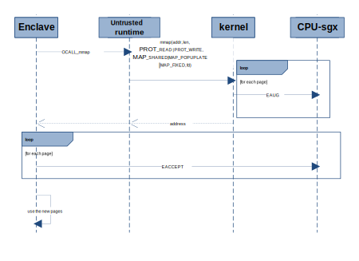
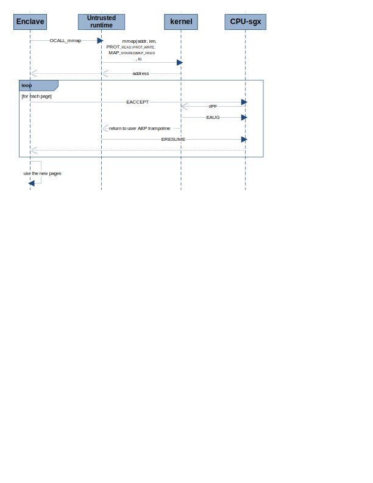
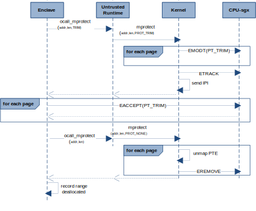
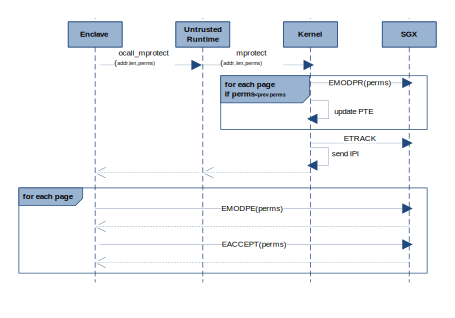
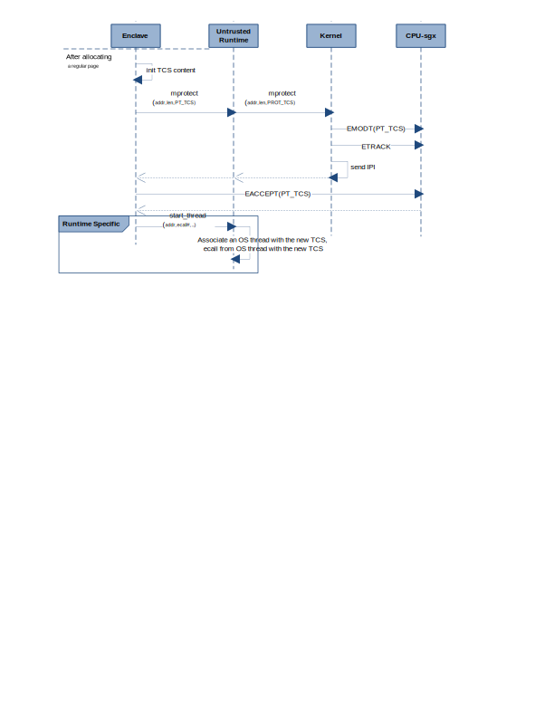

SGX EDMM Driver Interface Design
=====================================

## Motivation

This document describes possible driver interfaces to facilitate discussions among SGX runtime implementors (e.g., https://github.com/openenclave/openenclave/pull/3639) on supporting different SGX EDMM flows.

Although interfaces described here are inspired to be as likely as possible a candidate for future kernel adoption, they are not intended to be a proposal for kernel implementation and are assumed to be implemented as an OOT driver. We hope from discussions enabled by this document, requirements and usage models can be identified to help shape future kernel interfaces. 

Without losing generality, this document may describe how upper layer user space components would use the interfaces. However, details of design and implementation of those components are intentionally left out. The PR mentioned above would provide more contexts on other user space components and their relationships. Further, for those who may want to learn basic principles behind Intel(R) SGX EDMM instructions and how they are typically used, please refer to following references:
- [HASP@ISCA 2016: 11:1-11:9](https://caslab.csl.yale.edu/workshops/hasp2016/HASP16-17.pdf)
- [Intel SDM Vol.4, Ch.36-42](https://software.intel.com/content/www/us/en/develop/articles/intel-sdm.html)

For design and implementation of current SGX1 support in upstream kernel (merged in 5.11RC), please refer to [this patch series](https://lwn.net/Articles/837121/)

## Basic EDMM flows

SGX EDMM instructions support dynamic EPC page allocation/deallocation for enclaves and page property modification post-EINIT.  Following are the basic EDMM flows on which other more advanced usages of EDMM can be built.

**Note:** The term "kernel" and "kernel space" are used in this document when general kernel space actions are described whether implemented in an OOT driver or in kernel tree. Kernel specific implementation details will be explicitly stated as "future kernel" or "kernel patches".  And implementation details such as OCalls issued by enclaves, ETRACK and IPI issued in kernel are generally omitted for brevity.

- Allocate a new page at an address in ELRANGE of an enclave. 
  - This can be an explicit syscall or triggered by #PF  when an unavailable page is accessed.
  - Kernel issues EAUG for the page. All new pages should have RW permissions initially.
  - The enclave then issues EACCEPT.
- Deallocate an existing page
  - Enclave signals via a syscall to kernel that a page is no longer in use. 
  - Kernel issues EMODT to change page type to PT_TRIM 
  - The enclave issues EACCEPT
  - Kernel issues EREMOVE on the page at appropriate time
- Change page type, for example, from PT_REG to PT_TCS or PT_TRIM. 
  - Enclave requests via a syscall to kernel to change type of a page from PT_REG to PT_TCS/PT_TRIM
  - Kernel issues EMODT to change page type to PT_TCS/PT_TRIM
  - The enclave issues EACCEPT
- Extend EPCM permissions of a page, e.g., R->RW/RX
  - Enclave issues EMODPE for the page
  - Enclave requests via a syscall that the kernel update the page table permissions to match. 
  - Kernel modifies permissions in PTE 
- Reduce EPCM permissions of a page, e.g. RW/RX->R
  - Enclave requests that the kernel restrict the permissions of an EPC page
  - Kernel performs EMODPR,  updates page tables to match the new EPCM permissions, 
  - Enclave issues EACCEPT
  
**Note:** Flows related to CET support inside enclave will be considered as a future enhancement.

Future kernel may extend mmap and mprotect syscalls to support SGX EDMM usages. But we can't add/change syscall interfaces from an out-of-tree driver.  So, in this proposal for possible driver implementation, we reuse mmap for dynamic enclave memory mapping and expose a new IOCTL, sgx_enclave_mprotect, for enclave page modification. 
 
## mmap

After enclave is initialized (EINIT IOCTL done), the standard Linux mmap syscall can be used to create a new mapping configured for dynamically allocating enclave memory using EAUG. Following comments are specific to SGX EDMM usages, please refer to [mmap man page](https://man7.org/linux/man-pages/man2/mmap.2.html) for generic definitions.  

### Remarks

- To create a mapping for dynamic enclave memory allocation, mmap must be called with an open enclave file descriptor and with PROT_READ | PROT_WRITE for protection flags. 
  - Enclave must issue EACCEPT for the pages after mmap before it can modify the content of the pages and extend/reduce permissions in secure way.
- The offset in mmap parameter must be zero for enclaves.
- MAP_* flags must be MAP_SHARED  | MAP_FIXED masked with optional flags:
    - MAP_POPULATE: hint for kernel to EAUG pages as soon as possible.  
    - MAP_GROWSDOWN: used for stacks.  The mapping will grow down to the next mapping.
- If and only if the address range are within the ELRANGE of the enclave associated with the file descriptor, the mapping will be created. However, user space should not expect EAUG be done by the mmap call.
  - The kernel can choose EAUG pages immediately (likely for MAP_POPULATE), or EAUG pages upon page faults within the VMA, similar to how kernel would allocate regular memory.
- The kernel will assume the newly requested mapping is for dynamic allocation and initial permissions must be RW until user space request changes later. 

**Implementation Notes:** Current [SGX kernel patches](https://patchwork.kernel.org/project/intel-sgx/patch/20201112220135.165028-11-jarkko@kernel.org/) limit PTE permissions to the EPCM permissions given in SEC_INFO during EADD IOCTL calls. The dynamic allocation mappings should not be subject to those limits. A possible implementation may have these changes:
  - sgx_encl_may_map 
    - enforces RW permissions for pages other than those loaded due to EADD or ECREAT.
    - set up flags to track dynamic pages: type, permissions flag
  - sgx_vma_mprotect
    - Allow permissions changes to dynamic pages within limitations of OS policies, e.g.,
	    - never allow WX
	    - SELinux policy specific to SGX enclaves
    - update flags for the dynamic pages

## munmap 
Calling munmap on an enclave page (dynamic allocated or not) has exactly the same effect of calling munmap on a regular RAM page. No sgx specific interface is needed. No behavior changes to current kernel space implementation.

### Remarks

- Enclave memory mapings are shared (MAP_SHARED). The mappings in shared processes are kept alive and independently until the process exits
    - munmap and closing file descriptors are not required for user space. A dead process automatically releases all mappings and file descriptors. 
- Upon all enclave mappings are removed and file handles to the enclave are closed, either by explicit munmap/fclose syscalls or when all hosting apps exited:
    - The kernel may mark its remaining pages are reclaimable and issue EREMOVE on them any time the kernel deems appropriate.

## mprotect IOCTL
This IOCTL emulates the mprotect syscall with SGX specific extensions. In future kernel implementation, it could be mprotect or pkey_mprotect syscall with sgx extensions for the "prot" parameter.

```
#define SGX_IOC_ENCLAVE_MPROTECT _IOW(SGX_MAGIC, 0x06, struct sgx_enclave_mprotect)
/**
 * struct sgx_enclave_mprotect - parameter structure for the
 *                                %SGX_IOC_ENCLAVE_MPROTECT ioctl
 * @addr:	address of the memory to change protections
 * @length:	length of the area.  This must be a multiple of the page size.
 * @prot:	this must be or'ed of following:
             PROT_READ
             PROT_WRITE
             PROT_EXEC
             PROT_TRIM (new): change the page type to PT_TRIM, implies RW. User space should immediately EACCEPT, and then  call mprotect with PROT_NONE.
             PROT_TCS (new): change the page type to PT_TCS
	     PROT_NONE: Signal the kernel EACCEPT is done for PT_TRIM pages. Kernel can EREMOVE the pages at a time it deems appropriate.
 */
struct sgx_enclave_mprotect {
	__u64	addr;
	__u64	length;
	__u64	prot;
};
```

### Remarks

Kernel should ensure that SGX instructions can succeed or catch and handle any fault.
  - The kernel may maintain EPCM information on each page which includes access permission RWX, page types of PT_REG, PT_TRIM, PT_TCS.
  - The kernel should EREMOVE pages of PT_TRIM only after user space signals kernel EACCEPT is done with mprotect(...,PROT_NONE,...). This is because EACCEPT may cause undesired #PF if the target page is already EREMOVED.
  - The kernel catches fault on EMODPR, EMODT and converts to error code returned to user space.

The enclave run-time (or trusted run-time) may implement a parallel memory management structure which would provide information to the enclave on the enclave memory mappings.  The run-time can have a trusted API analogous to mmap which makes a call out of the enclave to issue the mmap  and then either perform EACCEPT on the pages and update the internal memory structures or configure the enclave to perform the EACCEPT when a #PF is delivered to the enclave.  With the outlined kernel interface, either implementation is possible.
## Sequence Diagrams for Basic Flows

### Direct Allocation with MAP_POPULATE



### \#PF Based Allocation



### EPC Deallocation



### Permission Changes



### TCS Allocation



## Example advanced flows

More advanced flows can be implemented as combinations of the basic flows. Here we present a few examples. 

### Dynamic code loading

An enclave can load trusted code to a new EPC page with execution permission using EACCEPT_COPY with following steps:
1. Enclave calls mmap for a region in enclave ELRANGE for EAUG
2. Enclave issues EACCEPT_COPY to copy trusted code from an existing EPC page to an unavailable page at an address inside that region
   - Mechanism for enclave to establish the trustworthiness of new code is out-of-scope here.
   - This results a #PF
3. Kernel EAUG the page on #PF, set RW permissions in both EPCM and PTE
4. The fault handler returns,  EACCEPT_COPY instruction retried, which sets RX permissions in EPCM specified in PageInfo operand.
5. Enclave makes ocall which invokes mprotect syscall to change PTE permissions from RW to RX 

### Lazy dynamic stack expansion
An enclave can lazily expand its stacks as follows.
1. Enclave calls mmap with MAP_GROWSDOWN for a stack region in enclave ELRANGE
2. At some time later, enclave pushes to the top of the stack where no EPC page is populated yet, this results in #PF, causing enclave AEX.
3. Kernel determines faulting address is in a stack region in enclave, EAUGs a page, injects a SIGBUS signal to enclave hosting process.
4. User space untrusted side signal handler catches the SIGBUS and delivers it into enclave exception handler
5. The enclave exception handler checks the faulting address against its record, determines the fault has happened in a stack area not yet EACCEPT'ed.
6. Enclave issues EACCEPT, returns to untrusted signal handler of the hosting process, which returns to kernel fault handler.
7. Kernel fault handler returns to enclave AEX address at which an ERESUME instruction is stored
8. Enclave resumed and the original push instruction is retried and succeeds.


