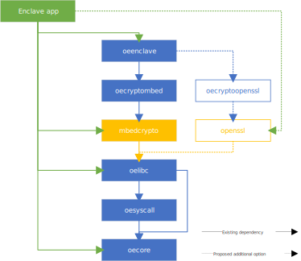

# OE Enclave Runtime Support for OpenSSL

## Motivation

Per discussion in issue [#852](https://github.com/openenclave/openenclave/issues/852):

- There are users of the OE SDK for which the existing mbedTLS library it ships with is insufficient to meet their needs.
  - It is not a pervasively used crypto library, which increases the costs of porting existing code into the enclave.
  - Although it has the appropriate Known Answer Tests and self-tests, it has never been officially FIPS 140-2 certified.
  - It represents a specific set of functionality that may not include what is needed by the developer, for example, Chinese national crypto algorithms.

- While there is a desire for a long-term solution to enable OE SDK users to replace the crypto library used by the OE enclave runtime with an arbitrary crypto library that meets their needs, it is acknowledged that supporting the OpenSSL library inside the OE enclave runtime will address some of these needs in the meantime.
  - OpenSSL is a widely used crypto library and is the _de facto_ standard crypto library available on many Linux distros. It is much more likely that existing code is using OpenSSL, which can be more easily ported into an enclave app.
    - Its API surface is often used as a standard that other crypto libraries either adopt (e.g. LibreSSL, BoringSSL) or already provide adaptor shims for (e.g. WolfSSL). As a result, supporting OpenSSL in the OE runtime also paves the way for a subset of other crypto libraries to be used in OE.
  - OpenSSL is commonly FIPS-certified as part of the Linux distros.
    - Even though the FIPS 140-2 certification applies to specific instances of the OpenSSL binaries, the presence of a prior certification for the library often influences the decision to adopt particular crypto libraries.
  - OpenSSL supports a different and slightly broader range of functionality and options compared to mbedTLS.

## User Experience

The OE SDK package will be expanded to include:

- A version of the OpenSSL libraries adapted for use in an enclave (the `openssl` component in the diagram).
- An OE-specific wrapper implementation to allow `oeenclave` to use OpenSSL instead of mbedTLS (the `oecryptoopenssl` component in the diagram).

An enclave app developer will have the choice at build time for their app to link either the `oecryptombed` or `oecryptoopenssl` wrappers against `oeenclave`, which will decide which crypto library `oeenclave` uses internally.

A developer can link both `mbedcrypto` and `openssl` components into their enclave app at the same time, even if `oeenclave` can only use a single wrapper at a time. For example, an app developer may choose to retain the dependency `oeenclave` has on `oecryptombed` but also additionally link in `openssl`. Doing so would allow the enclave app to use some functionality available in OpenSSL but not mbedTLS, even though `oeenclave` continues to use mbedTLS. This would not be a recommended use case because of the increase in the Trusted Computing Base (TCB) of the enclave app, but it is allowed.

Note that `mbedcrypto` is an abstraction over the libmbedcrypto, libmbedx509, and
 libmbedtls libraries. In the same way, `openssl`, as represented in the diagram, will encapsulate both libcrypto and libssl.

## Specification

The prototype for this support already exists in the [openenclave-openssl project](https://github.com/openenclave/openenclave-openssl). This design proposes formally integrating that work into the OE SDK project, which would require the following tasks:

- Add OpenSSL as a git submodule to the OE SDK project.
- Port the [build and code changes](https://github.com/openenclave/openenclave-openssl/blob/master/0001-Get-openssl-to-build-against-MUSL-headers.-Use-SGX-r.patch) necessary to build OpenSSL for use in an enclave to the OE SDK project.
- Refactor the existing OE SDK enclave/crypto into enclave/crypto/mbedtls.
- Port the prototype [oecrypto/src/crypto](https://github.com/openenclave/openenclave-openssl/tree/master/oecrypto/src/crypto) into OE SDK project enclave/crypto/openssl.
  - The set of oecrypto methods used internally by the OE SDK that needs to be implemented in OpenSSL is expected to be at parity with enclave/crypto/mbedtls.
- Port the prototype [tests](https://github.com/openenclave/openenclave-openssl/tree/master/test) for OpenSSL running in an enclave into OE SDK project as tests/openssl.
- Integrate an OpenSSL variant into existing OE SDK tests that rely on crypto:
  - [attestation_cert_apis](https://github.com/openenclave/openenclave-openssl/tree/master/oecrypto/test/attestation_cert_apis)
  - attestation_plugin
  - [crypto](https://github.com/openenclave/openenclave-openssl/tree/master/oecrypto/test/crypto)
  - crypto_crls_cert_chains
  - qeidentity
  - report
  - sealkey
  - tls_e2e
- Port the prototype [OpenSSL server in enclave sample](https://github.com/openenclave/openenclave-openssl/tree/master/sample/openssl_server) to OE SDK.
  - This sample serves as the analog to the existing mbedTLS-specific file-encryptor sample.
- Integrate an OpenSSL variant into existing OE SDK samples that rely on crypto:
  - [attested_tls](https://github.com/openenclave/openenclave-openssl/tree/master/sample/attested_tls)
  - data-sealing
  - local_attestation
  - remote_attestation
- Document the support for OpenSSL in OE SDK, i.e. add documentation analogous to [MbedtlsSupport.md](https://github.com/openenclave/openenclave/blob/master/docs/MbedtlsSupport.md)

Also, all prototypes have technical gaps that will need to be addressed for production purposes. A non-exhaustive list of such tasks would include:

- [ ] Add ctr_drbg.c to the `oecryptoopenssl` library implementation for parity with `oecryptombedtls`.
- [ ] Update OpenSSL code changes to use `oe_get_entropy()` for entropy pool seeding, and avoid modifying the OpenSSL drbg code.
- [ ] Formalize additional syscall stubs needed for OpenSSL as needed for [ssl_stubs.c](https://github.com/openenclave/openenclave-openssl/blob/master/0001-Get-openssl-to-build-against-MUSL-headers.-Use-SGX-r.patch).
- [ ] Update the OpenSSL target branch to the latest [OpenSSL_1_1_1-stable](https://github.com/openssl/openssl/tree/OpenSSL_1_1_1-stable) and resolve test coverage differences or breaking changes.
- [ ] Evaluate the set of [broken OpenSSL tests](https://github.com/openenclave/openenclave-openssl/blob/master/test/tests.broken) when executed in an enclave.

## Alternatives

As mentioned in the motivation, there is a desire for a long-term solution to enable OE SDK users to replace the crypto library used by the OE enclave runtime with an arbitrary crypto library. One approach to enable this is to formalize the internal OE crypto API that is being implemented by `oecryptombedtls` and `oecryptoopenssl` in this proposal. This approach is an additive change that we may pursue in the future and does not obviate the support proposed here.

An additional refinement of that approach is to eliminate the internal OE crypto API layer entirely:

- OE SDK calls OpenSSL APIs directly instead of using its `oecrypto` indirection.
- `oecryptoopenssl` becomes unnecessary, and `oecryptombedtls` would need to be refactored to be an mbedTLS to OpenSSL API adaptor instead.
- Other crypto libraries that are already compatible or have existing shims with the OpenSSL API can be reused with minimal change.

This option is not being pursued currently because:

- As with the option to expose the existing `oecrypto` API for adaptation, it is additive to the proposed solution and can be incrementally pursued at a later date.
  - Since it doesn't formalize the `oecrypto` API for crypto libraries to adapt against publicly at this time, the current proposal also avoids introducing a breaking change for enclave crypto libraries in the future.
  - The deeper refactor to use OpenSSL directly in OE is effectively an optimization at that point by removing a layer of indirection, but at the cost of a full rewrite of the `oecryptombedtls` wrapper to continue supporting it. The relative value of doing this work is currently lower than just allowing OpenSSL to be used by the OE runtime; it already allows other OpenSSL-compatible libraries to be ported more easily into OE enclaves, while not incurring the immediate `oecryptombedtls` refactor costs.
- OpenSSL is also currently in the process of its transition to its next major release (3.0), and it makes sense to target that version intercept as the more broadly stable crypto API surface to support.

## Authors

Simon Leet (@CodeMonkeyLeet)
