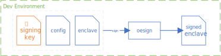
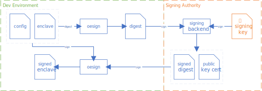

# Support for Digest Signing in oesign

This document proposes updates to the command line interface of the public oesign tool to support 
a digest signing workflow for production enclaves. 


## Motivation

Per issue #2089:

> oesign takes the signing key and enclave to sign in a single step today, which is not amenable for production signing scenarios as the owner of the private key is usually in a locked-down environment that is separate from the build pipeline.
>
> Similar to Intel's sgx_sign tool, oesign needs to support _digest signing_, where:
>
> 1. The lower trust build environment invokes oesign to generate a digest of the enclave
> 2. Only the digest is sent to the high trust production signing environment for signing
> 3. The resulting signature is returned to the build environment where oesign is invoked again to embed the signature to the enclave binary.

Effectively, oesign only supports the developer signing workflow today:



And it should support a production signing workflow where keys are owned by a separate signing authority:



## User Experience

To sign an OE enclave binary _my_enclave_ with the optional metadata specified in _my_enclave.conf_ and the _enclave_signing_key.pem_ owned by a different signing authority:
- The oesign steps are done by the signature requestor (e.g. as part of a build pipeline).
- The resulting _my_enclave.dig_ is sent to a signing authority that owns the private key to sign the digest and return _my_enclave.dig.signed_ for the signature requestor to embed in _my_enclave_.
  - The example below assumes OpenSSL is used by the signing authority, but this can be any RSA signing interface used by the signing authority (e.g. hardware security modules).
  - Note that the signing authority must distribute the public key in the form of _enclave_signing_cert.cer_ to the signature requestor for the final step, whether it's as a well-known public certificate or as additional collateral returned to the signature requestor with _my_enclave.dig.signed_.

```bash
oesign digest -e my_enclave -c my_enclave.conf -d my_enclave.dig

openssl pkeyutl -sign -in my_enclave.dig -pkeyopt digest:sha256 -inkey enclave_signing_key.pem -keyform PEM -out my_enclave.dig.signed

oesign sign -e my_enclave -c my_enclave.conf -x enclave_signing_cert.cer -d my_enclave.dig.signed
```

A couple of additional user experience considerations to keep in mind for this design:

1. Given that sgx_sign already supports such functionality and has a user base familiar with it, it is preferable if the oesign implementation is not radically different and provides an easy transition experience.
2. The oesign tool is also expected to work well on Windows development environments, where the supporting toolchain is likely different. Notably, signtool is commonly part of the Windows developer tools for application signing, and it would be nice if the digest signing process also worked well with it. For example, consider the effect of replacing the signing authority step with one that uses signtool instead:

```cmd
signtool sign /fd sha256 /ds /f enclave_signing_cert.pfx my_enclave.dig
```

## Specification

### 1. Add a digest command to oesign

To generate the digest, we add a new command of the following form:

```
Usage: ./oesign digest {--enclave-image | -e} ENCLAVE_IMAGE {--config-file | -c} CONFIG_FILE {--digest-file | -d} DIGEST_FILE

Where:
    ENCLAVE_IMAGE -- the path of the enclave image file
    CONFIG_FILE -- a configuration file containing enclave properties (optional)
    DIGEST_FILE -- the path of the output digest file
```

This command will:
- Measure the enclave using `oe_sgx_build_enclave()` with `OE_SGX_LOAD_TYPE_MEASURE` as with signing today.
- Use the resulting `enc.hash` to call `_init_sigstruct()` (requires refactoring) and hash the sigstruct, stopping short of the call to `oe_rsa_private_key_sign()`.
- Write out the raw binary hash value to the _DIGEST_FILE_.

Additional options to consider:
- Note that the intermediate output proposed here (binary hash of signature fields) is different from sgx_sign (binary serialization of the enclave sigstruct sections to be signed). Using the hash provides better encapsulation of the intermediate format, and also makes it more amenable to use on Windows (see next point). The difference in tooling should be minimal relative to the sgx_sign experience, with the signing authority calling `openssl pkeyutl` as illustrated in the user experience section, instead of `openssl dgst`.
  
- For compatibility with the signtool `/ds` option, we could consider adding a `--format` option to write out the _DIGEST_FILE_ as a base64-encoded string. Adding built-in support for base64 encoding is not a high priority since the digest can still be base64 encoded or decoded between the calls to signtool and oesign:

  ```cmd
  certutil -encode my_enclave.dig tmp.out && findstr /v /c:- tmp.out > my_enclave.dig.b64

  certutil -decode my_enclave.dig.signed.b64 my_enclave.dig.signed
  ```

### 2. Modify the oesign sign command to support digest signing

This could be a new command, or a variant set of parameters specified to the existing _sign_ command as follows:

```
Usage: ./oesign sign {--enclave-image | -e} ENCLAVE_IMAGE {--config-file | -c} CONFIG_FILE {--x509 | -x} CODE_SIGN_CERTIFICATE {--digest-file | -d} DIGEST_SIGNATURE_FILE

Where:
    ENCLAVE_IMAGE -- the path of the enclave image file
    CONFIG_FILE -- configuration file containing enclave properties
    CODE_SIGN_CERTIFICATE -- the path to PEM-encoded x509 certificate with the public key
                             used to sign DIGEST_SIGNATURE_FILE
    DIGEST_SIGNATURE_FILE -- the path of the digest signature file matching the enclave image
                             and configuration
```

This command will:
- Repeat everything that the digest command did (measure the enclave, initialize a sigstruct, and hash it.)
- Extract the public key from _CODE_SIGN_CERTIFICATE_.
- Load the _DIGEST_SIGNATURE_FILE_ and verify it against the public key and sigstruct hash.
  - This step is necessary to ensure that all the inputs are consistent.
  - The file is expected to be in raw binary format, for consistency with the digest file format.
- Populate the rest of the sigstruct and embed it into the target _ENCLAVE_IMAGE_. This means:
  - Extract the Q1 and Q2 values from the public key to populate the sigstruct.
  - Add the digest signature to the sigstruct.

Additional options to consider:
- For parity with the existing sgx_sign tool, we may also want to support taking a _KEY_FILE_ instead of a certificate.
  - The _KEY_FILE_ only needs to contain the public key matching the signed digest in this case.
  - The reason for using a certificate here is that most signing authorities tend to distribute public keys as certificates rather than raw keys, and the preference would be to support the more common case as default.
 
- For compatibility with Windows, we could also consider adding format support for DER-encoded certificates as well. Again, this is not a deal-breaker as certutil also provides straightforward conversion as needed:
  ```cmd
  certutil -decode my_cert.pem my_cert.der
  ```

## Alternates

This proposal has some overlap with the ask to support cryptography library extensions in oesign (see #2090). While a crypto extension (e.g. OpenSSL engine) could also be used to redirect a signing request from oesign to a remote signing authority controlling the access to private signing keys, there are several differences:

- It's a much more heavyweight solution that potentially requires the user to implement a custom crypto extension engine.
- It's a solution that does not currently work on Windows as oesign for Windows does not implement KSP support for BCrypt as of PR #2455.
  - Alternatively, it's a solution that is not portable between Windows and Linux signing environments without some additional work in oesign tool to support OpenSSL on Windows.
- It doesn't provide a transition path for users familiar with the digest signing experience already supported by Intel SGX SDK users familiar with sgx_sign.

For these reasons, this explicit support for digest signing in oesign is still considered valuable and distinct from supporting cryptographic library extensions.


## Authors

@CodeMonkeyLeet