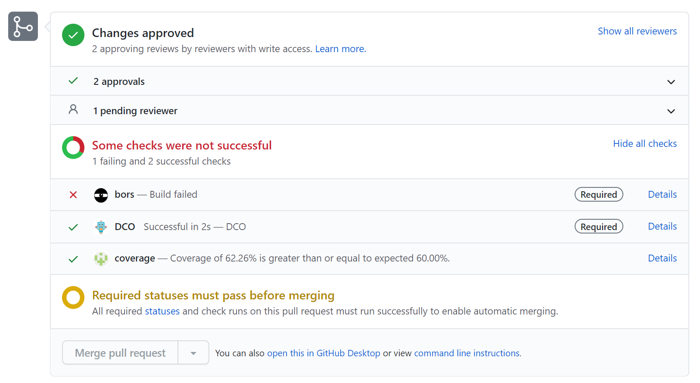

# Code Coverage in Open Enclave

This document shows how to get the code coverage of OE.
The code coverage analysis is based on [Gcov](https://gcc.gnu.org/onlinedocs/gcc/Gcov.html), a source-based coverage implementation provided by GNU GCC.
Currently, both Clang and GCC supports Gcov.

*Note*: The current implementation of OE only supports clang-7.

# Prerequisites

Install the packages that are necessary for the offline analysis.

## Dependent APT packages

`sudo apt install lcov python python-pip llvm-7`

## Dependent PyPI package

`sudo pip install lcov_cobertura`

# CMake Configuration

| Variable                 | Description                                          |
|--------------------------|------------------------------------------------------|
| CODE_COVERAGE            | Enable code coverage when setting to *ON*. Default is *OFF*. |
| BUILD_LIBGCOV            | Build the libgcov only when setting to *ON*. Note that this option is only effective when CODE_COVERAGE is *OFF*. |

# Code Coverage of Core Libraries

To get the code coverage of the OE core libraries given the existing test suite, run the following commands from the build subfolder.

## Configure the build with code coverage enabled.

 `cmake .. -DCODE_COVERAGE=ON`

## Build

`make`

## Run the test suite

`ctest`

## Offline analysis

`make code_coverage`

This command parses the runtime Gcov data of the test run and generates the reports.

The exapmle command line output is as follows.
```
Writing data to cov_filtered.info
Summary coverage rate:
  lines......: 63.0% (10318 of 16372 lines)
  functions..: 76.8% (774 of 1008 functions)
  branches...: 40.3% (4679 of 11603 branches)
Built target code_coverage
```

The reports can be found in `build/coverage/coverage.xml` (cobertura) and `build/coverage/cov_filtered.info` (lcov).

## Code Coverage reports for PRs

After a bors run on a PR, developers can view the code coverage report on the PR.


Click on "Details" to drill into the code coverage report.
