# Building And Debugging Using Visual Studio Code

This document provides a brief overview of how to build and debug Open Enclave applications using VS Code.

## Install VS Code

The latest version of Visual Studio Code can be installed from [https://code.visualstudio.com/](https://code.visualstudio.com/)

## Install VS Code Extensions

Install the following VS Code extensions. Click on an image to navigate to the Visual Studio Code Marketplace page for the extension.

[](https://marketplace.visualstudio.com/items?itemName=ms-vscode.cpptools)

[](https://marketplace.visualstudio.com/items?itemName=vector-of-bool.cmake-tools)

[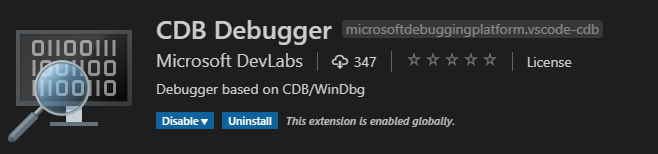](https://marketplace.visualstudio.com/items?itemName=MicrosoftDebuggingPlatform.vscode-cdb)

## Launch Visual Studio Code
Open an instance of x64 Native Tools Command Prompt. This ensures that cmake is available in the path.


Change to the directory containing your Open Enclave Application and launch VS Code in the current folder.

```cmd
cd YourApplicationFolder
code .
```

In the example here, we are using the HelloWorld sample that is installed as part of the SDK.
If the Open Enclave SDK is installed at `C:\openenclave`, then you would do the following:

```cmd
cd C:\openenclave\share\openenclave\samples\helloworld
code .
```

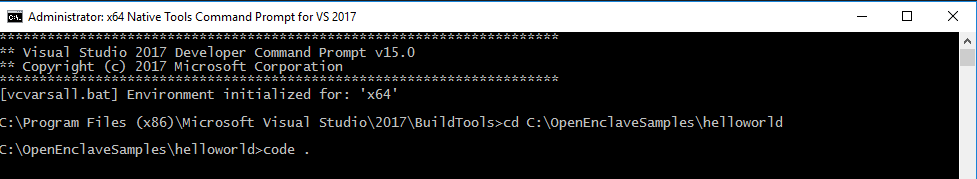

## Configure Your Workspace

Open Workspace Settings by pressing Ctrl+Shift+P and typing "Open Workspace Settings" in the command palette.


Search for the setting "CMake Configure Args" and add an item `-DNUGET_PACKAGE_PATH=path-to-openenclave-nuget-packages\prereqs\nuget`.
Add another item `-DOpenEnclave_DIR=YourOpenEnclaveInstallFolder\lib\openenclave\cmake`

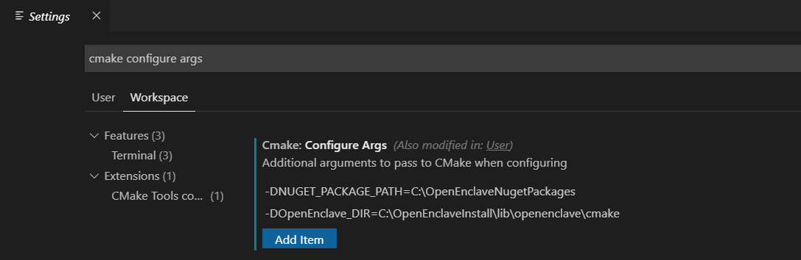

For example, if you ran install-windows-prereqs.ps1 with -InstallPath C:\openenclave_prereqs, and you installed the OE SDK nuget package to C:\openenclave, Settings.json would be as below:

```json
{
    "cmake.configureArgs": [
        "-DNUGET_PACKAGE_PATH=C:\\openenclave_prereqs\\prereqs\\nuget",
        "-DOpenEnclave_DIR=C:\\openenclave\\lib\\openenclave\\cmake"
    ]
}
```

Configure your workspace by typing "cmake configure" in the command palette

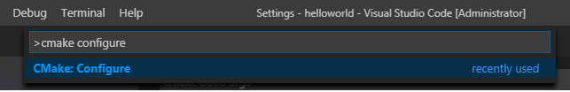

Configuration should successfully complete.


## Build And Run Your Open Enclave Application

Build the application by pressing Shift+F7 or typing "CMake Build a target" in the command palette, and selecting the "all META" target.

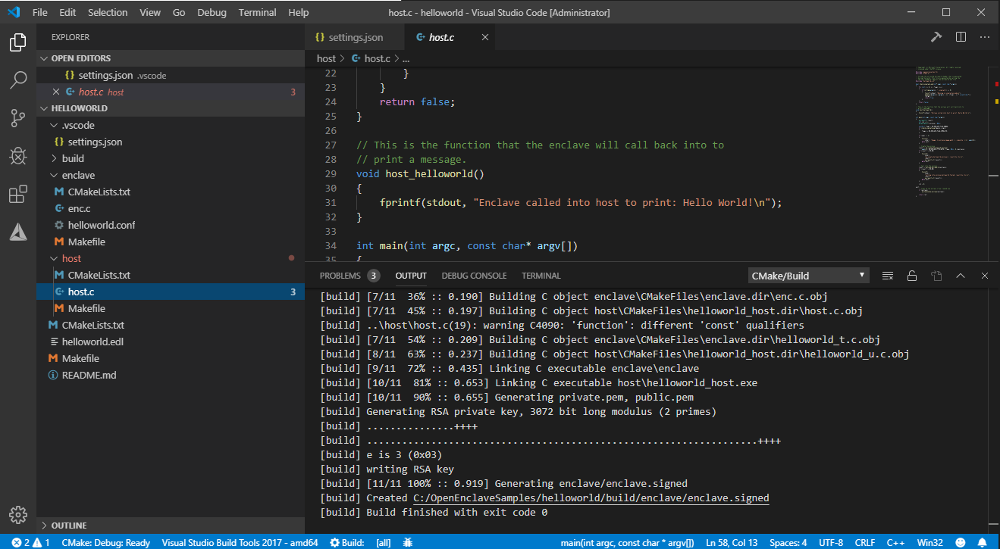

Run your application by pressing Shift+F7 or typing "CMake Build a target" in the command palette, and selecting the "run UTILITY" target.

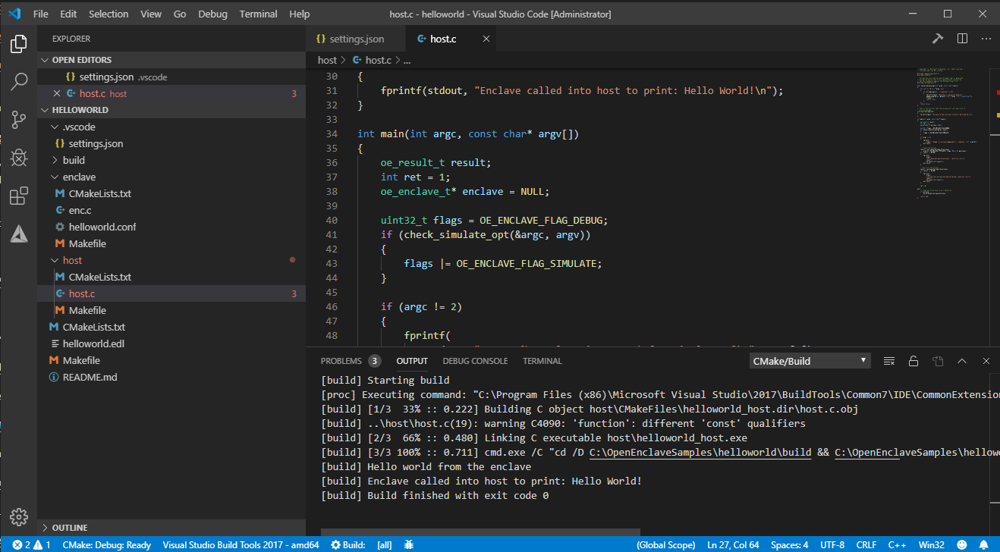

## Configuring Intellisense

Intellisense should work out of the box for files within your workspace. However, Intellisense may not be aware of where to locate the Open Enclave SDK headers.
Open settings.json (or create one) under the .vscode folder and add entries for "C_Cpp.default.includePath" and "C_Cpp.default.systemIncludePath".
If you installed the Open Enclave SDK at `C:\openenclave`, under Cmake: Configure Settings > Edit in settings.json

```json
{
    "cmake.configureArgs": [
        "-DNUGET_PACKAGE_PATH=C:\\openenclave_prereqs\\prereqs\\nuget",
        "-DOpenEnclave_DIR=C:\\openenclave\\lib\\openenclave\\cmake"
    ],
    "C_Cpp.default.includePath": ["C:\\openenclave\\include"],
    "C_Cpp.default.systemIncludePath": [
        "C:\\openenclave\\include\\openenclave\\3rdparty\\libc",
        "C:\\openenclave\\include\\openenclave\\3rdparty\\libcxx"
    ]
}
```

## Debug Your Open Enclave Application

Add a CDB Debug Configuration as shown below.

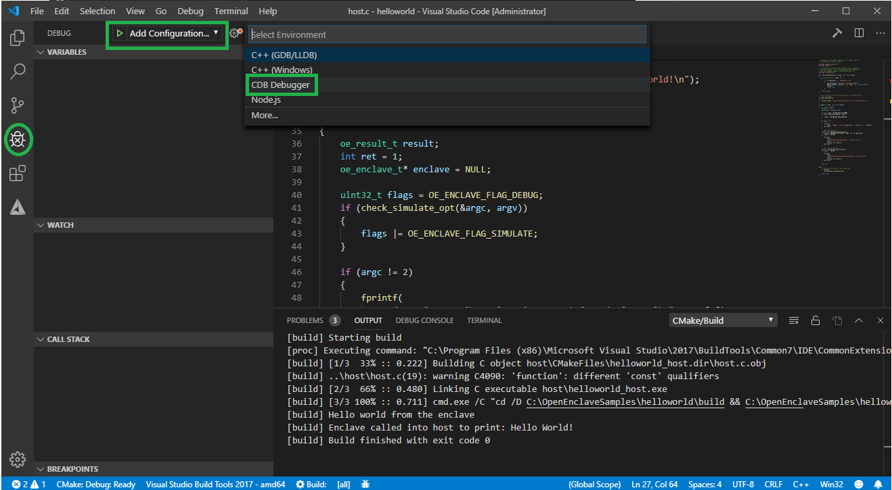

Fill in program path, parameters and other values in the configuration.

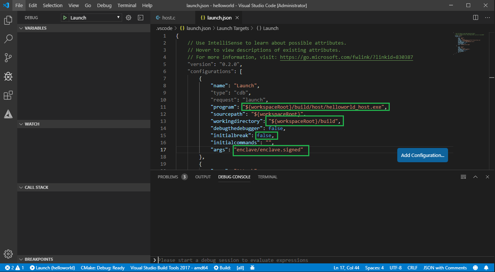

Here is an example of launch.json after editing it.
{
    // Use IntelliSense to learn about possible attributes.
    // Hover to view descriptions of existing attributes.
    // For more information, visit: https://go.microsoft.com/fwlink/?linkid=830387
    "version": "0.2.0",
    "configurations": [
        {
            "name": "Launch",
            "type": "cdb",
            "request": "launch",
            "program": "${workspaceRoot}/build/host/helloworld_host.exe",
            "sourcepath": "${workspaceRoot};C:/ignite/openenclave-sdk-src",
            "workingdirectory": "${workspaceRoot}/build",
            "debugthedebugger": false,
            "initialbreak": false,
            "initialcommands": ".sympath \"\"",
            "args": "enclave/enclave.signed"
        }
    ]
}

Open host.c and add a breakpoint. Start debugging.


Step over the line that creates the enclave. The Console pane should show that the enclave has been loaded.

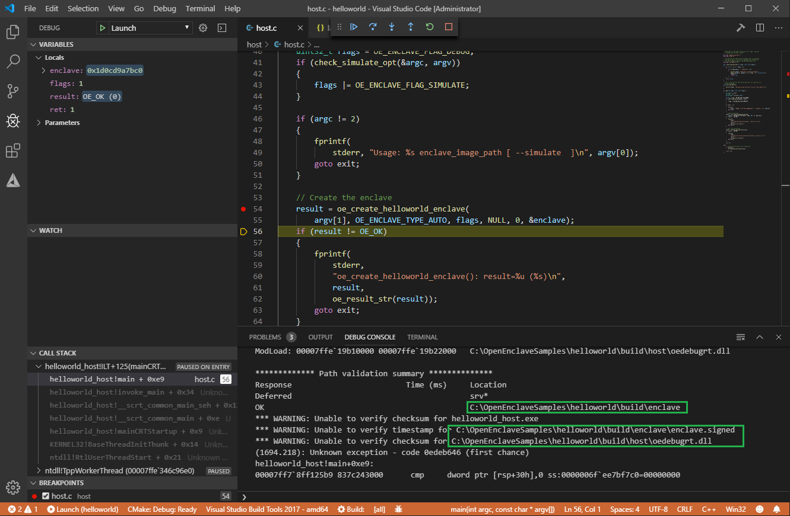

Note: [CDB commands](https://docs.microsoft.com/en-us/windows-hardware/drivers/debugger/) can be executed in the Console Prompt.

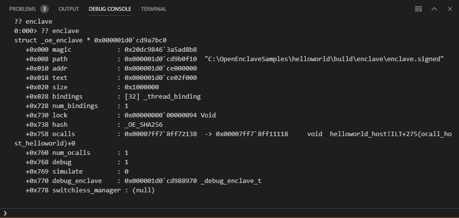

Open enc.c and put a breakpoint and continue execution.

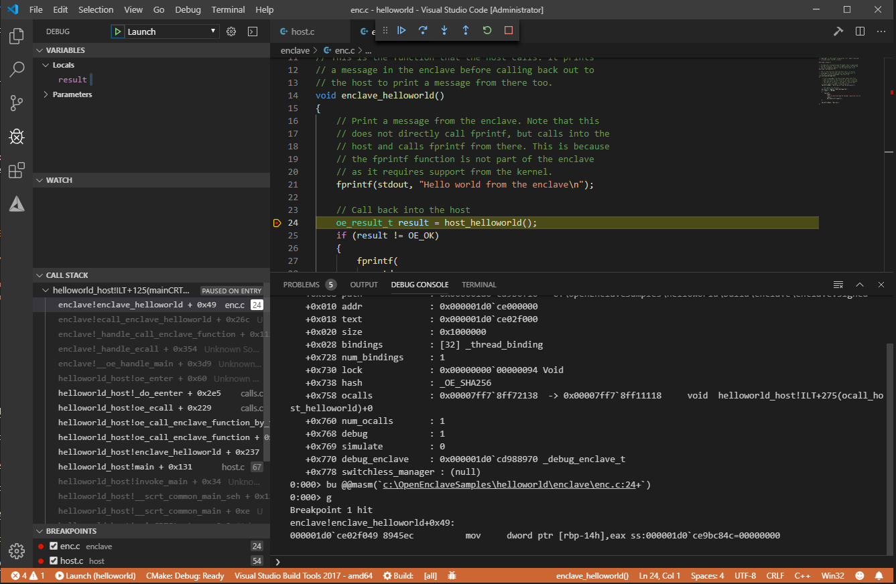


## Known Issues

The VS Code Debugger extension is currently released as an early preview.
These issues are being worked on and will be fixed in an upcoming update.

- Breakpoints aren't yet completely persisted and restored correctly.
Therefore it is recommended that you clear all breakpoints and set them again every time the program is launched for debugging.
- Debugging session is not terminated when the program runs to completion.
Therefore it is recommended that you stop and start a new debugging session each time.
- The debug cursor often jumps to the start of the file while debugging within an enclave.
Stepping again should take the cursor to the correct location.
