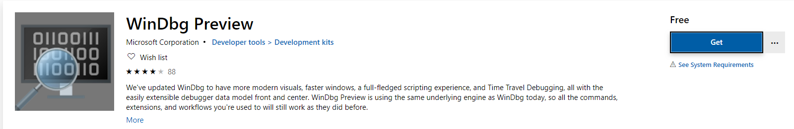
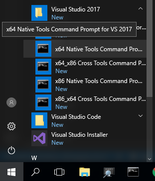
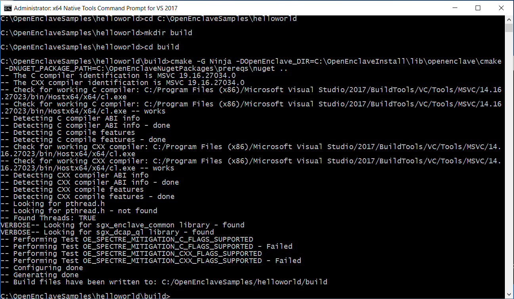
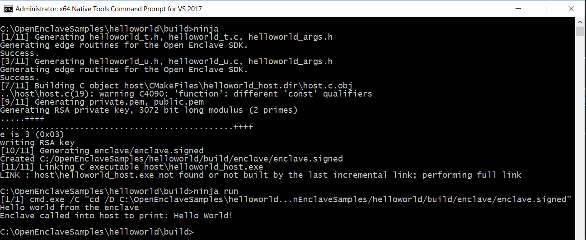
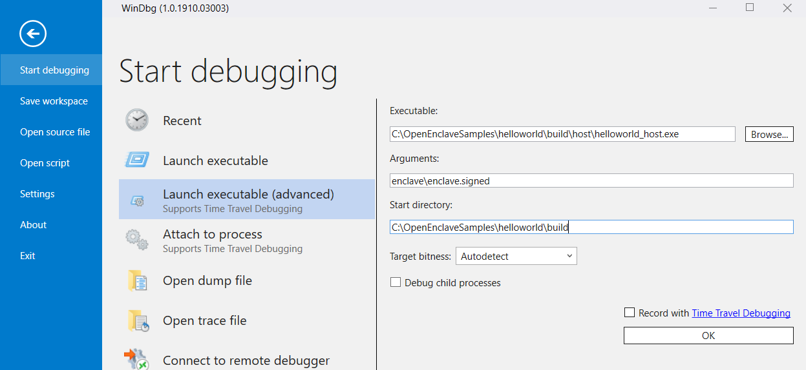
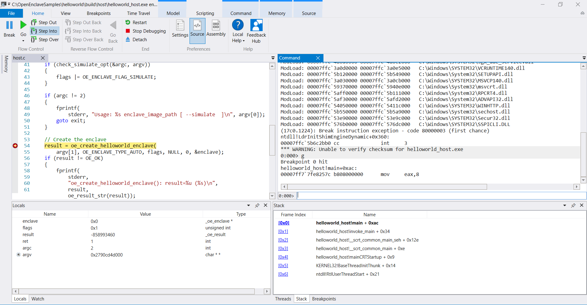
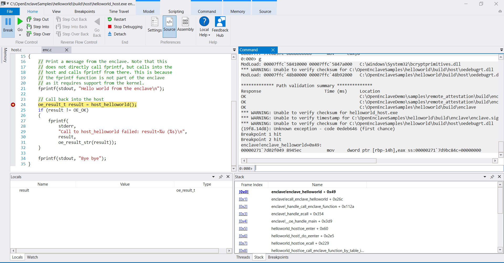

# Debugging ELF Enclaves Using WinDbg Preview

This document provides a brief overview of how to debug Open Enclave applications using WinDbg Preview.

# Install WinDbg Preview

WinDbg Preview can be installed from the Windows Store on a Win 10 machine.

[](http://aka.ms/WinDbgPreview)

WinDbg Preview supports debugging OpenEnclave applications since [1.0.1908.30002]( https://aka.ms/WinDbgWhatsNew#10190830002)

Currently WinDbg Preview can be installed only on a Win 10 machine from the Windows Store.
Join the github [discussion](https://github.com/microsoftfeedback/WinDbg-Feedback/issues/19) if you want WinDbg Preview to be installed anywhere.

In order to use WinDbg Preview on any Windows machine, copy the contents of `C:\Program Files\WindowsApps\Microsoft.WinDbg_*build*` 
to your target machine, and launch the `DbgX.Shell` application.

# Building Your Open Enclave Application

Open an instance of x64 Native Tools Command Prompt



Change to the directory containing your Open Enclave Application. Make a build folder and configure your application as shown below by defining the `CMAKE_PREFIX_PATH` and `NUGET_PACKAGE_PATH` configuration arguments.


```cmd
cd YourApplicationFolder
mkdir build
cd build
cmake -G Ninja -DCMAKE_PREFIX_PATH=your-open-enclave-install-path\lib\openenclave\cmake -DNUGET_PACKAGE_PATH=your-openenclave-nuget-packages-path ..
```




Build your application by running `ninja` and run your application by executing `ninja run`.



# Debugging Your Open Enclave Application

Note that to debug an Open Enclave application under windbg, `oedebugrt.dll`(found in `your-open-enclave-install-path\bin`) needs to be in the same folder as the host executable.
In the samples, this is automatically achieved via a call to the `copy_oedebugrt_target` cmake module. Please see the Helloworld sample's [CMakeLists.txt](../../samples/helloworld/CMakeLists.txt) for an example of how to call `copy_oedebugrt_target`.

Launch `DbgX.Shell` application. Click on `File-> Start debugging -> Launch executable(advanced)` and specify the program name arguments (path to the enclave) and working directory.



Open your host application and put a breakpoing on the source line that creates the enclave and continue execution till that line is hit.




Step over the line that creates the enclave.


Open your enclave source code, put a breakpoint and continue executin till that breakpoint is hit.




Explore various WinDbg commands and features.


## Known Issues

These issues are being worked on and will be fixed in an upcoming update.

- The debug cursor often jumps to the start of the file while debugging within an enclave. Stepping again should take the cursor to the correct location.
