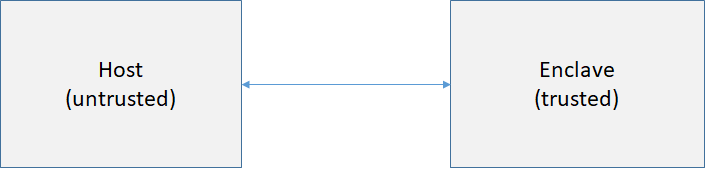

# Building Open Enclave SDK Samples on Linux

All the samples that come with the Open Enclave SDK installation share a similar directory structure and build instructions. This document describes how to setup, build, sign, and run these samples.

## Common Sample information

### How Sample source code directories were structured

Open Enclave SDK helps developers build enclave applications. An enclave application is partitioned into an untrusted component (called a host) and a trusted component (called an enclave). An enclave is a secure container whose memory (text and data) is protected from access by outside entities, including the host, privileged users, and even the hardware. All functionality that needs to be run in a Trusted Execution Environment (TEE) should be compiled into the enclave binary. The enclave may run in an untrusted environment with the expectation that secrets will not be compromised. A host is a normal user mode application that loads an enclave into its address space before starting interacting with an enclave. 



All the samples that come with the Open Enclave SDK installation are all structured into two subdirectories (one for enclave and one for host) accordingly.

| Files/dir        |  contents                                   |
|:-----------------|---------------------------------------------|
| Makefile         | Makefile for building all samples           |
| ./enclave        | Files needed for building the sample enclave|
| ./host           | Files needed for building the host          |

For example:

```bash
/home/yourusername:~/openenclave/share/openenclave/samples/helloworld$ ls -l
total 12
drwxr-xr-x 2 yourusername yourusername 4096 Aug 16 13:59 enclave
drwxr-xr-x 2 yourusername yourusername 4096 Aug 16 13:59 host
-rw-r--r-- 1 yourusername yourusername  245 Aug 16 13:57 Makefile
```

### Prepare samples

Building samples involves writing files into the working directory, which is not allowed in `/opt` unless it's running in the context of superuser (`sudo`).

Before building any of the samples, please copy them out of the /opt/openenclave/share/openenclave/samples directory to a directory where your current user has write permissions. A normal user usually does not have permission to write files into a directory in /opt.

For example, assuming Open Enclave SDK is installed to the default location `/opt/openenclave`:

```bash
cp -r /opt/openenclave/share/openenclave/samples ~/mysamples
```
### How to build and run samples

Each sample comes with two different build systems: one using GNU Make and pkg-config, the other using CMake. They help simplify the sample building process, which involves building and signing
binaries.

#### Source the openenclaverc file (Required)

Before building any samples, you need to source the `openenclaverc` file to setup environment variables for sample building. `openenclaverc` file can be found in  the `share/openenclave` subdirectory of the package installation destination.

You can use `.` in Bash to `source`:

```bash
. <package_installation_destination>/share/openenclave/openenclaverc
```

For example, if your package_installation_destination is /opt/openenclave:

```bash
. /opt/openenclave/share/openenclave/openenclaverc
```

Note: You will get error messages like the following if this sourcing step was skipped.

```sh
make[2]: Entering directory '.../openenclave/samples/helloworld/enclave`
Package oeenclave-clang was not found in the pkg-config search path.
Perhaps you should add the directory containing `oeenclave-clang.pc`
```

#### Build and Run samples

##### GNU Make

To build a sample using GNU Make, change directory to your target sample directory and run `make build` to build the sample.
Then execute "make run" to run the sample.

For example:

```bash
~/openenclave/share/openenclave/samples$ cd helloworld/
~/openenclave/share/openenclave/samples/helloworld$ make build
~/openenclave/share/openenclave/samples/helloworld$ make run
```

##### CMake

To build a sample using CMake, change directory to your target sample directory and execute the following commands:

mkdir build && cd build
cmake ..
make

Then execute "make run" to run the sample.

For example:

```bash
~/openenclave/share/openenclave/samples$ cd helloworld/
~/openenclave/share/openenclave/samples/helloworld$ mkdir build && cd build
~/openenclave/share/openenclave/samples/helloworld/build$ cmake ..
~/openenclave/share/openenclave/samples/helloworld/build$ make
~/openenclave/share/openenclave/samples/helloworld/build$ make run
```

##### Note:
For details on how to configure build and sign options, refer to [Enclave Building and Signing](https://github.com/openenclave/openenclave/blob/master/docs/GettingStartedDocs/buildandsign.md).

#### Build and Run samples with LVI mitigation

Refer to [here](helloworld#build-and-run-with-lvi-mitigation) for more details.

## Samples

The following samples demonstrate how to develop enclave applications using OE APIs. It's recommended to go through the following samples in the order listed.

#### [HelloWorld](helloworld/README.md)

- Minimum code needed for an OE app
- Help understand the basic components an OE application
- Demonstrate how to build, sign, and run an OE image
- Demonstrate how to optionally apply LVI mitigation to enclave code

#### [File-Encryptor](file-encryptor/README.md)

- Show how to encrypt and decrypt data inside an enclave
- Use AES mbedTLS API to perform encryption and decryption

#### [Data-Sealing](data-sealing/README.md)

- Introduce OE sealing and unsealing features
- Demonstrate how to use OE sealing APIs
- Explore two supported seal polices
  - OE_SEAL_POLICY_UNIQUE
  - OE_SEAL_POLICY_PRODUCT

#### [Remote Attestation](remote_attestation/README.md)

- Explain how OE attestation works
- Demonstrate an implementation of remote attestation between two enclaves running on different machines

#### [Local Attestation](local_attestation/README.md)

- Explain the concept of OE local attestation
- Demonstrate an implementation of local attestation between two enclaves on the same VM

#### [Attested TLS](attested_tls/README.md)

- Explain what an Attested TLS channel is
- Demonstrate an implementation for how to establish an Attested TLS channel
  - between two enclaves
  - between one non-enclave client and an enclave

#### [Switchless Calls](switchless/README.md)

- Explain the concept of switchless calls
- Identify cases where switchless calls are appropriate
- Demonstrate how to mark a function as `transition_using_threads` in EDL
- Demonstrate how to configure an enclave to enable switchless calls originated within it
- Recommend the number of host worker threads required for switchless calls in practice
- Demonstrate how to enable switchless calls in an enclave application

#### [Host-side Enclave Verification](host_verify/README.md)

- Explain the concept of host-side enclave verification
- Demonstrate attestation of a remote SGX enclave from outside an enclave

#### [Pluggable Allocators](pluggable_allocator/README.md)

- Demonstrate how to replace the default memory allocator by plugging in a custom allocator
  that performs better in multi-threaded enclaves.
- Provide overview of how to make an enclave-compatible allocator pluggable.
