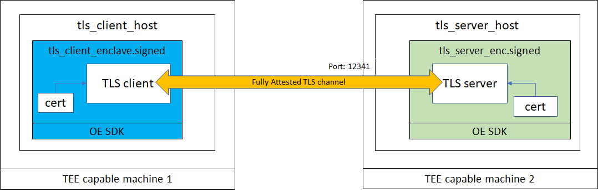
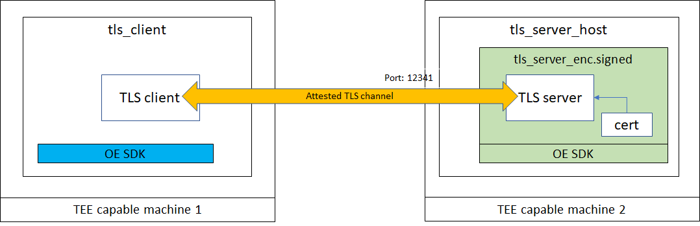

## Prerequisites
 The audience is assumed to be familiar:
 [What is an Attested TLS channel](AttestedTLSREADME.md#what-is-an-attested-tls-channel)

# The attested_tls sample

It has the following properties:

- Demonstrates attested TLS feature
  - between two enclaves
  - between an enclave application and a non enclave application
- Use of mbedTLS within enclaves for TLS
- Enclave APIs used:
  - oe_get_attestation_certificate_with_evidence
  - oe_free_attestation_certificate
  - oe_verify_attestation_certificate_with_evidence

**Note: Currently this sample only works on SGX-FLC systems.** The underlying SGX library support for end-to-end remote attestation is required but available only on SGX-FLC system. There is no plan to back port those libraries to either SGX1 system or software emulator.

## Overall Sample Configuration

In first part of this sample, there are two enclave applications in this sample: one for hosting an TLS client inside an enclave and the other one for an TLS server.

 

In the 2nd part of this sample, there is one regular application functioning as a non-enclave TLS client and an enclave application
instantiating an enclave which hosts an TLS server.

 

Note: Both of them can run on the same machine or separate machines.

### Server application
  - Host part (tls_server_host)
    - Instantiate an enclave before transitioning the control into the enclave via an ecall.
  - Enclave (tls_server_enclave.signed)
    - Calls oe_get_attestation_certificate_with_evidence to generate an certificate
    - Use Mbedtls API to configure an TLS server after configuring above certificate as the server's certificate
    - Launch a TLS server and wait for client connection request
    - Read client payload and reply with server payload
  - How to launch a server instance
```
../server/host/tls_server_host ../server/enc/tls_server_enc.signed -port:12341
```
### Enclave Client application
  - Host part (tls_client_host)
    - Instantiate an enclave before transitioning the control into the enclave via an ecall.
  - Enclave (tls_client_enclave.signed)
    - Calls oe_get_attestation_certificate_with_evidence to generate an certificate
    - Use Mbedtls API to configure an TLS client after configuring above certificate as the client's certificate
    - Launch a TLS client and connect to the server
    - Send client payload and wait for server's payload
  - How to launch a client instance
```
../client/host/tls_client_host ../client/enc/tls_client_enclave.signed -server:localhost -port:12341
```

### Non-enclave Client application
 - When used in this scenario, this non-enclave client is assumed to be a trusted party holding secrets and only shares it with the server after the server is validated
 - Connect to server port via socket
 - Use OpenSSL API to configure a TLS client
 - Call oe_verify_attestation_certificate_with_evidence to validate server's certificate
 - Send client payload and wait for server's payload

```
../client/tls_non_enc_client -server:localhost -port:12341
```

## Build and run

To build and run the samples, refer to documentation in the main [README file](../README.md#building-the-samples.md).

Note: This sample uses an OE SDK customized version of mbedtls library for TLS channel connection. It has MBEDTLS_NET_C component enabled, which has a dependency on the newly added [socket support](../../docs/UsingTheIOSubsystem.md#socketh) in 0.6.0 OE SDK release (for more details see [Using the Open Enclave I/O subsystem](../../docs/UsingTheIOSubsystem.md#opting-in) for details). So in order to build successfully, you would need to link with liboehostsock and libhostresolver libraries to satisfy the dependency.

### Running attested TLS server in loop
By default the server exits after completing a TLS session with a client. `-server-in-loop` run-time option changes this behavior to allow the TLS server to handle multiple client requests.

On Linux:

```bash
./server/host/tls_server_host ./server/enc/tls_server_enc.signed -port:12341 -server-in-loop
or
make run-server-in-loop
```

On Windows after building the sample as described in the [README file](../README.md#building-the-samples.md):

```cmd
.\server\host\tls_server_host .\server\enc\tls_server_enc.signed -port:12341 -server-in-loop
```
