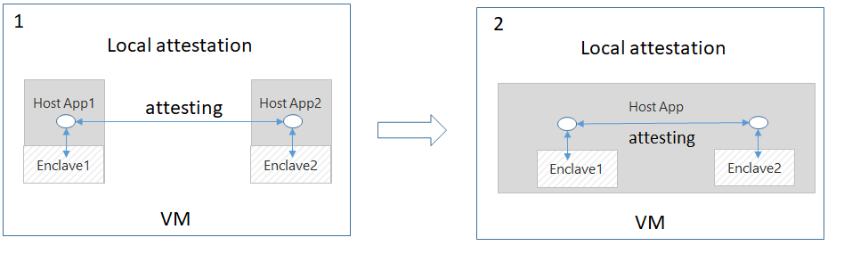

# The Local Attestation Sample

In a typical Open Enclave application, it's common to see multiple enclaves working together to achieve common goals. They would need to attest each other before a trust could be established.
Once an enclave verifies the counterpart is trustworthy, they can exchange information on a protected channel, which typically provides confidentiality, integrity and replay protection.
This sample demonstrates how to conduct local attestation between two enclaves on the same system and establish a secure communication channel for exchanging messages between them.

It has the following properties:

- Written in C++
- Demonstrates an implementation of local attestation
- Use of mbedTLS within the enclave
- Use Asymmetric / Public-Key Encryption to establish secure communications between two attesting enclaves
- Enclave APIs used:
  - oe_verifier_initialize,
  - oe_attester_initialize,
  - oe_serialize_custom_claims,
  - oe_deserialize_custom_claims,
  - oe_get_evidence,
  - oe_verify_evidence,
  - oe_verifier_get_format_settings

## Attestation primer

See [Remote Attestation's README](../remote_attestation/README.md#attestation-primer) for information

## Local Attestation sample

This sample demonstrates how to attest two enclaves to each other locally by using Open Enclave APIs: `oe_get_evidence`, `oe_verifier_get_format_settings`, and `oe_verify_evidence`. They work together to complete a local attestation process.

To simplify this sample without losing the focus in explaining how the local attestation works, host1 and host2 are combined into one single host to eliminate the need for additional  code for inter-process communication between two hosts.
Diagram 2 is the configuration used in this sample.



### Local Attestation steps

For two enclaves on the same system to locally attest each other, the enclaves need to know each other’s identities. OE SDK provides `oe_get_evidence`, `oe_verifier_get_format_settings`, and `oe_verify_evidence` APIs to help broker the identity retrieval, exchange and validation between two enclaves.

Here are the basic steps of a typical local attestation between two enclaves.

Let's say two enclaves involved are enclave_a and enclave_b.

1. Inside enclave_a, call `oe_get_evidence` to get enclave_a's report.

2. Send enclave_a's identity to enclave_b.

3. Inside enclave_b, create an **enclave_b report targeted at enclave_a**, that is, a report with enclave_b's identity
   signed so that enclave_a can verify it.

4. Send the enclave_b report above to enclave_a.

5. Inside enclave_a, call `oe_verify_evidence` to verify enclave_b report, on success, it means enclave_b was successfully attested to enclave_a.

Step 1-5 completes the process of local attesting enclave_b to enclave_a

Repeating step 1-4 with reverse roles of enclave_a and enclave_b can achieve attesting enclave_a to enclave_b.

### Authoring the Host

The host application coordinates the local attestation steps described above for helping local attestation process.

The host does the following in this sample:

1. Create two enclaves for attesting each other, let's say they are enclave_a and enclave_b

    ```c
    oe_create_localattestation_enclave( enclaveImagePath, OE_ENCLAVE_TYPE_SGX, OE_ENCLAVE_FLAG_DEBUG, NULL, 0, &enclave);
    ```

2.  Attest enclave 1 to enclave 2

    ```c
    attest_one_enclave_to_the_other("enclave_a", enclave_a, "enclave_b", enclave_b);
    ```

3. Attest enclave 2 to enclave 1

    ```c
    attest_one_enclave_to_the_other("enclave_b", enclave_b, "enclave_a", enclave_a);
    ```

    With successfully attestation on each other, we are ready to securely exchange data between enclaves via asymmetric encryption.

4. Get encrypted message from 1st enclave

    ```c
    generate_encrypted_message(enclave_a, &ret, &encrypted_msg, &encrypted_msg_size);
    ```

5. Sending the encrypted message to 2nd enclave to decrypt and validate if the decrypted
   message is correct.

   Note: both enclaves hardcode their sample messages for this validation.

    ```c
    process_encrypted_message(enclave_b, &ret, encrypted_msg, encrypted_msg_size);
    ```

#### attest_one_enclave_to_the_other() routine

This routine handles the process of attesting enclave_b to enclave_a with the following three steps.

```c
get_enclave_format_settings(enclave_a, &ret, &format_settings, &format_settings_size);

get_targeted_evidence_with_public_key(
        enclave_b,
        &ret,
        format_settings,
        format_settings_size,
        &pem_key,
        &pem_key_size,
        &evidence,
        &evidence_size);

verify_evidence_and_set_public_key(
        enclave_a, &ret, pem_key, pem_key_size, evidence, evidence_size);

```

### Authoring the Enclave

#### Attesting an Enclave

Let's say, we want to attest enclave 2 to enclave 1.

Attesting an enclave consists of three steps:

##### 1) Get an enclave's oe_verifier_get_format_settings

If anything specific from verifier needs to be included for evidence generation,
call oe_verifier_get_format_settings and get the required format settings.

```c
oe_result_t oe_verifier_get_format_settings(
    const oe_uuid_t *format_id,
    uint8_t **settings,
    size_t *settings_size);
```


##### 2) Generate a targeted report

Inside enclave 2, call oe_get_evidence with uuid  = OE_FORMAT_UUID_SGX_LOCAL_ATTESTATION. This creates a enclave_b report that' targeted at enclave 1,
that is, for enclave 1 to validate.

```c
oe_result_t oe_get_evidence(
    const oe_uuid_t *format_id,
    uint32_t flags,
    const void *custom_claims_buffer,
    size_t custom_claims_buffer_size,
    const void *optional_parameters,
    size_t optional_parameters_size,
    uint8_t **evidence_buffer,
    size_t *evidence_buffer_size,
    uint8_t **endorsements_buffer,
    size_t *endorsements_buffer_size);
```

##### 3) Verify targeted report


Integrity of the Enclave Report

Enclave 1 can call `oe_verify_evidence` to validate the report originated from an Trust Execution Environment (TEE),
which in this case would be a valid SGX platform.

```c
    oe_result_t oe_verify_evidence(
       const oe_uuid_t *format_id,
       const uint8_t *evidence_buffer,
       size_t evidence_buffer_size,
       const uint8_t *endorsements_buffer,
       size_t endorsements_buffer_size,
       const oe_policy_t *policies,
       size_t policies_size,
       oe_claim_t **claims,
       size_t *claims_length);
```

At this point, Enclave 1 knows that the report originated from an enclave running in a TEE, and that the information in the report can be trusted.

##### 4) Verifying Enclave identity

`Attestation::attest_local_attestation_evidence()` performs enclave identity validation by examining these claims:

* "signer_id"
* "product_id"
* "security_version"
* "Public key hash" claim in custom claims ("custom_claims_buffer")

## Using Cryptography in an Enclave

The attestation `local_attestation/common/crypto.cpp` file from the sample illustrates how to use mbedTLS inside the enclave for cryptographic operations such as:

- RSA key generation, encryption and decryption
- SHA256 hashing

In general, the Open Enclave SDK provides default support for mbedTLS layered on top of the Open Enclave core runtime with a small integration surface so that it can be switched out by open source developers in the future for your choice of crypto libraries.

See [here](https://github.com/openenclave/openenclave/tree/master/docs/MbedtlsSupport.md) for supported mbedTLS functions

## Build and run

In order to build and run this sample, please refer to the common sample [README file](../README.md#building-the-samples).