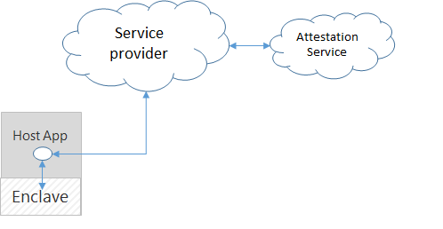
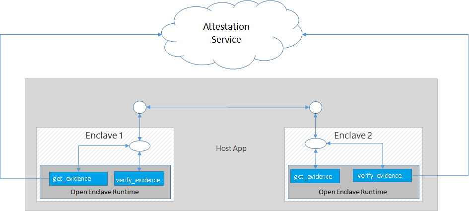

# The Remote Attestation Sample

This sample demonstrates how to do remote attestation between two enclaves and establish a secure communication channel for exchanging messages between them.

It has the following properties:

- Written in C++
- Demonstrates an implementation of remote attestation
- Use of mbedTLS within the enclave
- Use Asymmetric / Public-Key Encryption to establish secure communications between two attesting enclaves
- Enclave APIs used:
  - oe_get_evidence
  - oe_verify_evidence,
  - oe_is_within_enclave

**Note: Currently this sample only works on SGX-FLC systems.** The underlying SGX library support for end-to-end remote attestation is available only on SGX-FLC system. There is no plan to back port those libraries to either SGX1 system or software emulator.

## Attestation primer

### What is Attestation

Attestation is the process of demonstrating that a software component (such as an enclave image) has been properly instantiated on an Trusted Execution Environment (TEE, such as the SGX enabled platform).

A successfully attested enclave proves:

- The enclave is running in a valid Trusted Execution Environment (TEE), which is Intel SGX in this case (trustworthiness).

- The enclave has the correct identity and runtime properties that has not been tampered with (identity).

  In the context of Open Enclave, when an enclave requests confidential information from a remote entity, the remote entity will issue a challenge to the requesting enclave to prove its identity and trustworthiness before provisioning any confidential information to the enclave. This process of proving its identity and trustworthiness to a challenger is known as attestation.

### Attestation types

There are two types of attestation:

- **Local Attestation** refers to two enclaves on the same TEE platform authenticating each other before exchanging information. In Open Enclave, this is done through the creation and validation of an enclave's `local report`.

  

- **Remote Attestation** is the process of a [trusted computing base (TCB)](https://en.wikipedia.org/wiki/Trusted_computing_base), a combination of HW and SW, gaining the trust of a remote enclave/provider. In Open Enclave, this is done through the creation and validation of an enclave's `remote report`.

  

### Secure Communication Channel

Remote Attestation alone is not enough for the remote party to be able to securely deliver their secrets to the requesting enclave. Securely delivering services requires a secure communication channel which is often guaranteed by Transport Layer Security (TLS).

A few alternatives for establishing a secure communication channel without TLS are:
1) Use the established ephemeral private keys to perform a signed Diffie-Hellman key exchange and use symmetric key cryptography to communicate after that point.
2) Generate an ephemeral symmetric key in one of the enclaves, say enclave_a, encrypt with the public key of enclave_b, sign with your private key and then send it to enclave_b. This will ensure that the symmetric key is only known to the two enclaves and the root of trust is in the remote attestation.

This remote attestation sample only demonstrates the remote attestation process but does not establish a secure communication channel or communicate secrets after that. Please note that the established public keys cannot be used to encrypt the messages as they are visible to the external world, including the host. The host can fake messages on behalf of the enclaves.

Here is a good article about [Intel SGX attestation](
https://software.intel.com/sites/default/files/managed/57/0e/ww10-2016-sgx-provisioning-and-attestation-final.pdf), which describes how Intel's SGX attestation works. The current Open Enclave's implementation was based on it for the SGX platform.

Note: `local report` is the same as an `Intel SGX report`, while the `remote report` is the same as an `Intel SGX quote`.

## Remote Attestation sample

In a typical Open Enclave application, it's common to see multiple enclaves working together to achieve common goals. Once an enclave verifies the counterpart is trustworthy, they can exchange information on a protected channel, which typically provides confidentiality, integrity and replay protection.

This is why instead of attesting an enclave to a remote (mostly cloud) service, this sample demonstrates how to attest two enclaves to each other by using Open Enclave APIs `oe_get_evidence` and `oe_verify_evidence` which takes care of all remote attestation operations.

To simplify this sample without losing the focus in explaining how the remote attestation works, host1 and host2 are combined into one single host to eliminate the need for additional socket code logic to deal with communication between two hosts.


### Authoring the Host

The host process is what drives the enclave app. It is responsible for managing the lifetime of the enclave and invoking enclave ECALLs but should be considered an untrusted component that is never allowed to handle plaintext secrets intended for the enclave.



The host does the following in this sample:

   1. Create two enclaves for attesting each other, let's say they are enclave_a and enclave_b

      ```c
      oe_create_remoteattestation_enclave( enclaveImagePath, OE_ENCLAVE_TYPE_SGX, OE_ENCLAVE_FLAG_DEBUG, NULL, 0, &enclave);
      ```

   2. Ask enclave_a for a remote evidence with call to get_remote_evidence_with_public_key()

   3. Ask enclave_b to verify the evidence with call to verify_evidence_and_set_public_key()

   4. Repeat step 2 and 3 for asking enclave_a to validate enclave_b

   5. Free the resource used, including the host memory allocated by the enclaves and the enclaves themselves

      For example:

      ```c
      oe_terminate_enclave(enclave_a);
      oe_terminate_enclave(enclave_b);
      ```

### Authoring the Enclave

#### Attesting an Enclave

Attesting an enclave consists of two steps:

##### 1) Generating an Enclave Report

The enclave being attested first needs to generate a cryptographically strong proof of its identity that the challenger can verify. In the sample this is done by asking the SGX platform to generate a `remote report` signed by Intel via the `oe_get_evidence` method with `OE_FORMAT_UUID_SGX_ECDSA` uuid. The `remote report` can be verified by the `oe_verify_evidence` method on a different machine.


##### 2) Verifying the integrity of the Enclave Report

Once the report is generated and passed to the challenger, the challenger can call `oe_verify_evidence` to validate the report originated from an Trust Execution Environment (TEE, in the case it's a valid SGX platform).

In the context of Open Enclave on Intel SGX platform, a remote report is verified using the certificate chain issued by Intel which is only valid for SGX platforms.

At this point, the challenger knows that the report originated from an enclave running in a TEE, and that the information in the report can be trusted.

Note that for the Public Preview, remote attestation verification is only supported in the Azure ACC VMs, but Intel will be expanding support for this with Open Enclave SDK more broadly moving forward.


##### 3) Verifying Enclave identity

The validation is performed in `Attestation::attest_remote_attestation_evidence()`. Instead of oe_identity_t struct, we now use claims:

* Ensure that the identity of the enclave matches the expected value:
  * Verify the `unique_id` claim if you want to match the exact bitwise identity of the enclave. Bear in mind that any patches to the enclave will change the `unique_id` claim in the future.
  * Verify the `signer_id` and `product_id` claims if you want to match the identity of an enclave that might span multiple binary versions. This is what the attestation sample does.
* Ensure that the `security_version` claim of the enclave matches your minimum required security version.
* Ensure that the "Public key hash" claim in the custom claims matches the hash of the data provided with the report, as illustrated by the sample.


## Using Cryptography in an Enclave

The attestation remote_attestation/common/crypto.cpp file from the sample illustrates how to use mbedTLS inside the enclave for cryptographic operations such as:

- RSA key generation, encryption and decryption
- SHA256 hashing

In general, the Open Enclave SDK provides default support for mbedTLS layered on top of the Open Enclave core runtime with a small integration surface so that it can be switched out by open source developers in the future for your choice of crypto libraries.

See [here](https://github.com/openenclave/openenclave/tree/master/docs/MbedtlsSupport.md) for supported mbedTLS functions

## Build and run

In order to build and run this sample, please refer to the common sample [README file](../README.md#building-the-samples).
